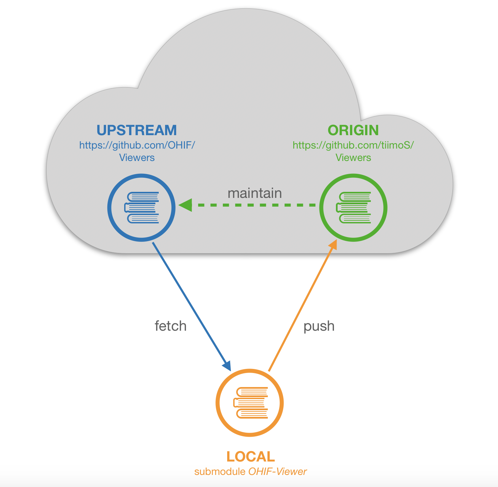

## Set up and launch the Modified Viewer application

2. Open a new terminal  tab and navigate to "Viewers" folder within the source code.

3. Remove the existing yarn.lock file inside the "Viewers" repository

4. Enable Yarn workspaces: 
```shell
yarn config set workspaces-experimental true
```
cd 
4. Install all dependencies using: 
```shell
yarn install
```

5. Run the application on the development server using: 
```shell
yarn run dev
```
See the Debug section below for common issues during installation. 

6. The 3dPicsViewer should open your web browser automatically on http://localhost:5000/.
## Maintain repo and modify Viewer
The OHIF-Viewer project is integrated into 3dPicsWeb as a submodule supporting a triangular workflow. 
The OHIF-Viewer can fetch changes from the official OHIF-Viewer using 
```shellyar
git fetch upstream 
```
from within the OHIF-Viewer folder. Changes to the viewer are pushed to a forked version of the Viewer, 
which allows to open merge requests later on. 



The overall structure looks as follows: 

## Changing configurations
To change the server configuration, edit the default.js file in the ./public/config folder. 

## Debug
1. Issues running the viewer: 
Follow the steps below before re-running the viewer. 
- remove the yarn.lock file
- remove the package-lock.json file
- remove the node-modules folder
- remove "babel-eslint" from the dependencies in package.json 
- remove "eslint" from the dependencies in package.json 
- re-run "yarn install" 
- re-run "yarn run dev"
